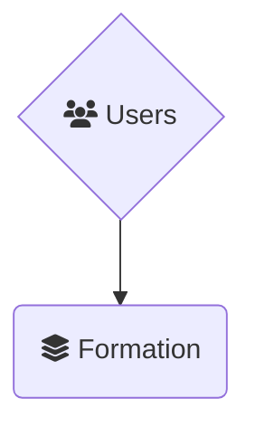
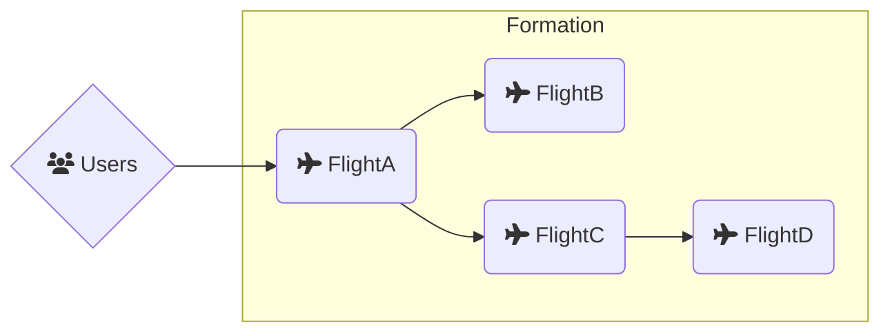
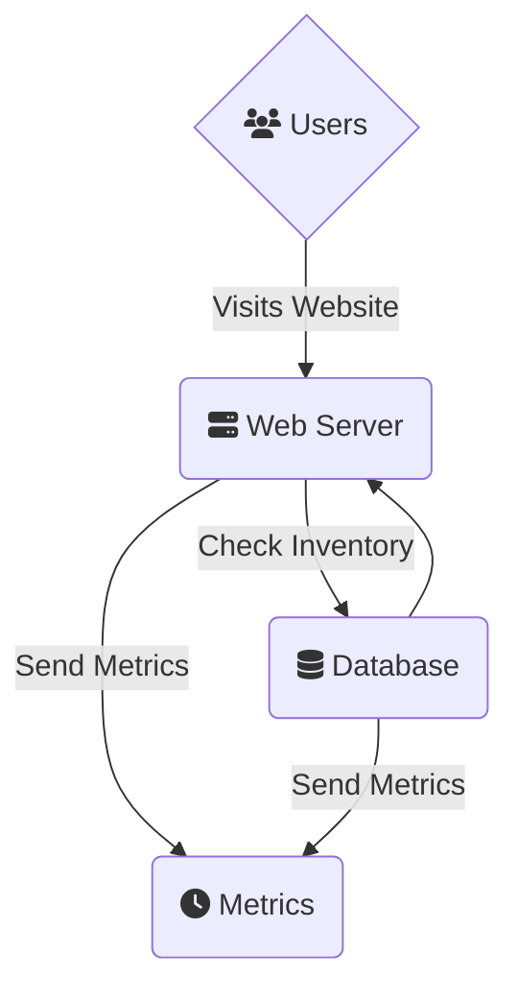

# Seaplane Terminology

This document describes the various terms used throughout Seaplane and the
associated CLI/SDK.

The best way to introduce these terms is in reverse, from the outer most
component that you'll interact with the most, to the physical components
running underneath the hood. This is because we want you to think about your
applications and services in this order; you shouldn't need to worry about the
low level building blocks unless we've done something wrong!

So bear with us as explain each term in turn!

## Formation

At the heart of Seaplane is your Formation(s). Formations can be thought of
as your high level *application* or *service* entry point. This is the entry
point for all traffic.

When using the `seaplane` CLI tool you will create local Formation *Plan*.
These plans can be used to create remote *Instances* running on our Seaplane
Cloud. But what is a Formation? A Formation is made up of Flights.
We'll discuss `flight`s in a moment.

**NOTE on Terms:** Throughout this document if we say "Formation" without
qualifying whether it's a *Plan* (which resides locally on your hard
drive), or an *Instance* (which is running in our Cloud based on your
definition); that means it applies equally to both concepts. Where there are
differences we will specifically say *Plan* or *Instance* as appropriate!

#### Deployed Formations

When you create a new Formation using the `seaplane` CLI tool, that Formation
only resides locally on your computer. You can edit or view this Formation Plan
freely without affecting any of the systems running in the Seaplane Cloud. Once
you're satisfied, you can `launch` the Formation to our Seaplane Cloud.

Once a configuration has been `launch`ed successfully, it now resides in our
Seaplane Cloud and traffic will be sent to the Flight that listed as the
*Gateway*. 

Which brings us to the heart of what Formation are actually describing...

That's the Flight!

## Flight

A Flight is logically a single container. It's essentially a named container
image. But we like our motif! However, unlike a single container, under the
hood we spin up many actual *container instances* and spread them around the
globe or within regions you specify.

When your users send traffic to Seaplane, it gets routed to the appropriate
Formation who describes the actual Flights it is made up of, and who ultimately
receive and process the user traffic.

To take a step back and describe a scenario in industry terms, imagine you are setting up a website
to sell your state of the art Airplane Landing Gear (sticking within our motif). Like many modern
web applications, your website will be made up of a few different components; a front facing
webserver, a backend database, and perhaps a backend metrics platform. You've already created the
container images for each of these components, and if you were to draw out a diagram of how they
interconnect, it would look something like this:

The important point is your webserver is the only component receiving public traffic, but the
backend components all may need to network with one another to form the entire service.

If we translate this into Seaplane terms we still get the exact same diagram, but we would describe
it like so:

- A "Landing Gear Website" `formation`
- The `formation`s `configuration` would specify
  - That it is made up of three `flight`s
    - A "webserver" `flight`
    - A "database" `flight`
    - A "metrics" `flight`
  - How public traffic arrives, and which `flight` to send it to
  - How the `flight`s are allowed to communicate/network with each-other

Now what's *really* neat to us, is that each of these Flights is not just a single physical
container, but it's own CDN like cluster! This makes your service (the Landing Gear Website in our
example) much more robust, and can drastically increase your performance as you sell these landing
gear to customers around the globe!

## Container Instance

The lowest level component we should address, and we've already mentioned it a
few times is the actual Container Instances themselves. We don't bring this up
first, because if everything is working as it should, these are invisible to
you and your users. Logically, the Flight is your container instance.

That being said, there are *rare* occurrences where you will need to think
about how Seaplane is distributing your traffic, and in those instances it's
important to know that there are actual container instances running under the
hood.

These container instances are controlled by your Flight and Formation
Plan. For the most part, you can let Seaplane handle the details of
how they get distributed. However, it is possible to network between physical
container instances individually when coordination is necessary. Doing so is
outside the scope of this guide, and is normally handled out-of-band.

## Container Image

Just like the container images you know an love from all your standard OCI
compliant tools. There is nothing fancy here. We instantiate your container
instances, which make up your Flights and form your Formations from good
ol' standard OCI images.
